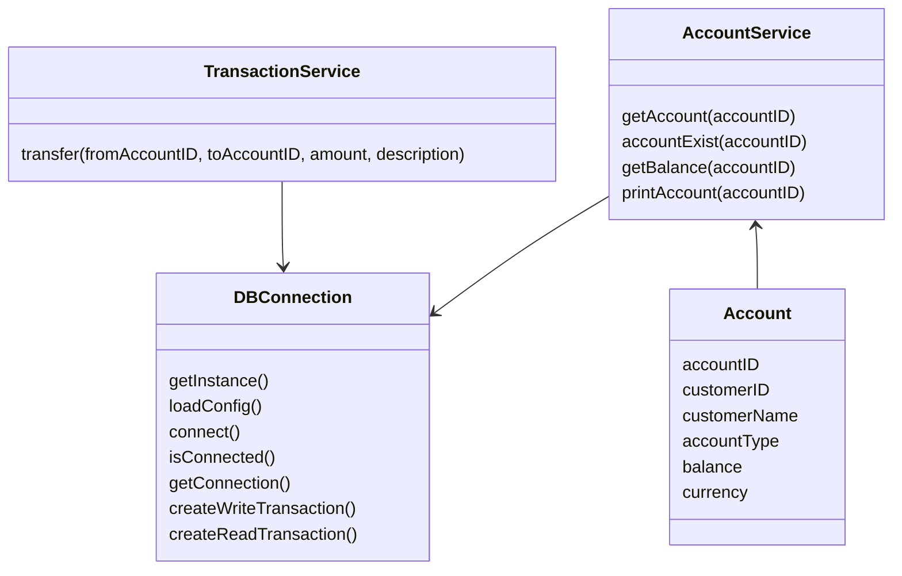
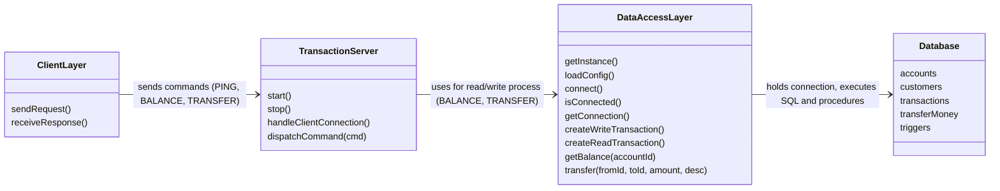

# Core Bank Infrastructure

by Victor Correa

This is an educational project developed with the main goal of providing a practical environment for learning and applying key concepts related to relational database design such as implementation, maintenance within the context of a simplified banking infrastructure system. Its targeted to be a complete, reproducible study environment where different layers of a financial application can be implemented and tested.

- [Motivation](#motivation)

- [Database](#database)

    - [Installing and Initializing PostgreSQL on ArchLinux](#installing-and-initializing-postgresql-on-archlinux)
    - [Running PostgreSQL for the first time](#running-postgresql-for-the-first-time)
    - [Creating a new database and defining tables on SQL](#creating-a-new-database-and-defining-tables-on-sql)
    - [Populating the database tables with data](#populating-the-database-tables-with-data)
    - [Defining Stored Procedures for database](#defining-stored-procedures-for-database)
    - [Unit Tests](#unit-tests)
    - [SQL Triggers](#sql-triggers)

- [Data Access Layer](#data-access-layer-dal)
    - [Installing and Using `libpqxx`](#installing-and-using-libpqxx)
    - [Database Connection Interface](#database-connection-interface)
        - [db_connection module](#db_connection-module)
            - [Linking, Compiling and test module](#linking-compiling-and-testing-db_connection)
        - [Account Service Module](#account-service-module)
        - [Transaction Service Module (transfer money between accounts)](#transaction-service-module-transfer-money-between-accounts)
            - [A small but annoying issue...](#a-small-but-annoying-issue)
    - [Checkpoint](#checkpoint)

- [Transaction Server](#transaction-server)

- [Appendix](#appendix)

    - [GoogleTest Framework](#appendix-1---googletest-framework)

    - [Network Programming](#appendix-2---network-programming)

    - [Concurrency in C++](#appendix-3---concurrency-in-c)

- [References and Tutorials](#references-and-tutorials)

## Motivation

Since the beginning of my career as a z/OS System Administrator, I have been deeply interested in a better understanding how large and complex infrastructures such as a core bank operates "under the hood". But working on these environments with high security and operational restrictions we have a very limited or no visibility at all into production databases, also a restricted access to stored procedure such as maintenance routines and reporting scripts, and the opportunity to modify or analyze systems at a foundational level is almost non existant.

Specially when it comes to banks, many critical components such as scripts, integration points, or business rules are already well established, and modifying them is an almost impossible process. This makes it quite challenging to clearly understand why things were build the way they were, how individual components interact with each other (for instance, how the Finance Team gets a report from all the transactions executed on a day from the database perspective?) or what the complete data flow looks like (what happens when a customer sends money to another one? What scripts and routines are involved in this process?). The architecture looks really "blurry" from the perspective of a beginning system administrator, leaving important details and questions really cloudy.

So I came up with this project idea, where I can build up a simple but working core infrastructure from scratch, in a controlled and unrestricted environment. Where I will be able to explore the database architecture with no restrictions, experiment some ideas and see what happens. I believe this will help me obtain a deeper understanding of how these applications work under the hood, integrating multiple languages and methods on a "realistic scenario".

Therefore, this project is a learning platform and a personal “laboratory” for developing practical knowledge in system architecture, database development and backend service design.

## Database

For this topic we'll need to learn relational modeling and SQL fundamentals. Also it's important to learn how to design a initial database schema and understand overall system architecture of a bank.

### Installing and Initializing PostgreSQL on ArchLinux

Here are the steps I've used to install and initialize PostgreSQL on Arch Linux:

- Install the latest PostgreSQL package

`sudo pacman -S postgresql`

- After installation, version can be checked with

`postgres --version`

- To confirm psql is not running (it should not be running after installation)

`sudo systemctl status postgresql`

- Login as the postgres user (always do this when doing admin tasks on psql)

`sudo su - postgres`

- Initializing data directory (default db: /var/lib/postgres/data)

`sudo -u postgres initdb --locale en_GB.UTF-8 -D /var/lib/postgres/data`

- Logout of **postgres** user

`exit`

- Confirm if psql is still not running

`sudo systemctl status postgresql`

- Start psql

`sudo systemctl start postgresql`

- Confirm psql is running (now it should be running)
`sudo systemctl status postgresql`

To create a new user on PostgreSQL:

- Login into postgres

`sudo su - postgres`

- Create a new user (**Note:** user can be called anything however if you create a PostgreSQL user with the same name as your Linux username, it allows you to access the PostgreSQL database shell without having to specify a user to login (which makes it quite convenient).)

`createuser --interactive`

- Enter name of role to add: `MY_LINUX_USERNAME`

    - Shall the new role be a superuser?: `y`

- Logout of **postgres** user

`exit`

- Restart psql

`sudo systemctl restart postgresql`

- Confirm psql is running (can check that it was restarted by looking at the timestamp on the ***Active*** field)

`sudo systemctl status postgresql`

> Default db for psql is /var/lib/postgres/data
> `sudo -u postgres initdb --locale en_GB.UTF-8 -D /var/lib/postgres/data`


### Running PostgreSQL for the first time

```bash
➜  ~ sudo -u postgres initdb --locale en_GB.UTF-8 -D /var/lib/postgres/data
The files belonging to this database system will be owned by user "postgres".
This user must also own the server process.

The database cluster will be initialized with locale "en_GB.UTF-8".
The default database encoding has accordingly been set to "UTF8".
The default text search configuration will be set to "english".

Data page checksums are enabled.

fixing permissions on existing directory /var/lib/postgres/data ... ok
creating subdirectories ... ok
selecting dynamic shared memory implementation ... posix
selecting default "max_connections" ... 100
selecting default "shared_buffers" ... 128MB
selecting default time zone ... Europe/**********
creating configuration files ... ok
running bootstrap script ... ok
performing post-bootstrap initialization ... ok
syncing data to disk ... ok

initdb: warning: enabling "trust" authentication for local connections
initdb: hint: You can change this by editing pg_hba.conf or using the option -A, or --auth-local and --auth-host, the next time you run initdb.

Success. You can now start the database server using:

    pg_ctl -D /var/lib/postgres/data -l logfile start
# Start PostgreSQL
➜  ~ sudo systemctl start postgresql
# Enable PostgreSQL
➜  ~ sudo systemctl enable postgresql
Created symlink '/etc/systemd/system/multi-user.target.wants/postgresql.service' → '/usr/lib/systemd/system/postgresql.service'.
```

### Creating a new database and defining tables on SQL

First we being with creating the database cluster with `CREATE DATABASE` SQL command, after the database is successfully created, we can begin populating the information on it. First we need to create tables which will store variables related to it. For instance, let's create a table `customers` where we store crucial data regarding the customers such as full name (first and last on separated columns), email, address, birthdate and etc. With a single SQL command we can do all of it:

```sql
CREATE TABLE customers (
    customer_id SERIAL PRIMARY KEY,
    name VARCHAR(100),
    email VARCHAR(120),
    date_of_birth DATE,
    address TEXT
);
```

We should also define a table that stores bank `accounts` info, which will relate an account_number to a `customer_id`. We want our accounts table to store information such as account namber, type, balance, associate it with an owner (customer id) referenced to the `customer` tables. This can be achieved with `REFERENCES` command in the following way:

```sql
CREATE TABLE accounts (
    account_id SERIAL PRIMARY KEY,
    customer_id INTEGER REFERENCES customers(customer_id),
    account_type VARCHAR(20),
    balance NUMERIC(12,2),
    created_at TIMESTAMP DEFAULT NOW()
);
```

For the transactions, we want to reference the account where the money left, to the account it went to. We also want to store information about the transaction itself, such as `transfer_id` which can be referenced to collect information about a specific transaction. The amount and timestamp will store the amount of money and the time the transaction happened.

```sql
CREATE TABLE transactions (
    transaction_id SERIAL PRIMARY KEY,
    from_account INTEGER REFERENCES accounts(account_id),
    to_account INTEGER REFERENCES accounts(account_id),
    amount NUMERIC(10,2),
    timestamp TIMESTAMP DEFAULT NOW()
);
```

### Populating the database tables with data

Now the database is populated with tables, but it's empty. We can begin populating its tables with the `INSERT` command. In this example, let's add a customer called `John Doe` and relate him to the account number `0001`, which will have an initial deposit of `1500$`

```sql
INSERT INTO customers (customer_id, name, email, date_of_birth, address)
VALUES (1, 'John Doe', 'jond@mail.com', '1985-06-12', 'Sample Street 42');

INSERT INTO accounts (account_id, customer_id, account_type, balance)
VALUES (0001, 1, 'checking', 1500.00);
```

To run this SQL script and create the database, tables and insert `John Doe`, we simply run:

```bash
$ psql -U postgres -f database/initdb.sql

# The ouput

CREATE DATABASE
You are now connected to database "StadtBankDB" as user "postgres".
CREATE TABLE
CREATE TABLE
CREATE TABLE
INSERT 0 1
INSERT 0 1
```

Now we can enter our database and check how it looks: the structure, the data we just added in and do some queries on the tables. First we enter the database with `postgres` user:

```bash
$ psql -d StadtBankDB
```

A display `\d` will show all the tables on our database, in which we can do a simple query on the customers table to check the entered information with `SELECT * FROM customers` and `accounts`:

```bash
StadtBankDB=# \d
                       List of relations
 Schema |              Name               |   Type   |  Owner
--------+---------------------------------+----------+----------
 public | accounts                        | table    | postgres
 public | accounts_account_id_seq         | sequence | postgres
 public | customers                       | table    | postgres
 public | customers_customer_id_seq       | sequence | postgres
 public | transactions                    | table    | postgres
 public | transactions_transaction_id_seq | sequence | postgres
(6 rows)

StadtBankDB=# SELECT * FROM customers;
 customer_id |   name   |     email     | date_of_birth |     address
-------------+----------+---------------+---------------+------------------
           1 | John Doe | jond@mail.com | 1985-06-12    | Sample Street 42
(1 row)

StadtBankDB=# SELECT * FROM accounts;
 account_id | customer_id | account_type | balance |         created_at
------------+-------------+--------------+---------+----------------------------
          1 |           1 | checking     | 1500.00 | 2025-11-14 10:25:29.161791
(1 row)

# From here we can see the transaction table is empty, because no transaction has been made yet:

StadtBankDB=# SELECT * FROM transactions;
 transaction_id | from_account | to_account | amount | timestamp
----------------+--------------+------------+--------+-----------
(0 rows)
```

But as the project grows up, we'll need to have more data on each table, and also find a more efficient way of adding up customers on the database. For now, I will rely on [this seed](/database/procedures/sample.sql) to populate my database with some customer data. To run this stored procedure:

```sh
$ psql -U postgres -d database1 -f database/procedures/sample.sql

Seeding customers...
INSERT 0 20
Seeding accounts...
INSERT 0 35
Seeding transactions...
INSERT 0 20
Sample data loaded successfully.;
```

### Defining Stored Procedures for database

For dealing with transactions (transfer money), adding new customers we can rely on Stored Procedures, which are prepared SQL code that can be saved. The code can be reused over and over again. So instead of having an SQL query that we must write over and over again, we can simply save it as a stored procedure, then just call it to be executed when needed.

Let's create a procedure called `moneyTransfer.sql` to safely transfer money between accounts. A function that transfers money between two accounts, in simplest form possible, needs the source account (where the money comes from) and a target account (where the money goes to), it also needs the amount of money being transfered and an optional description for the receiving account. We can begin creating a function with `CREATE FUNCTION function_name` SQL command (**Note:** Adding the `OR REPLACE` command to either CREATE or REPLACE an existing function with the same name). For more information about creating functions in PostgreSQL [click here](https://www.postgresql.org/docs/current/sql-createfunction.html). This function receives the following as parameters:

```sql
CREATE OR REPLACE FUNCTION transferMoney(
    /* from account - source account */
    transf_from_account INT,
    /* destination account */
    transf_to_account   INT,
    /* Amount to be transfered */
    transf_amount       NUMERIC(12,2),
    /* Optional Details on the transfer */
    transf_description  TEXT DEFAULT 'Transfer'
)
```

We know this function will work in the following way:

1. First it must check if the transfer amount entered is valid (greater than zero). A simple check can be done by:

```sql
-- Validate the amount set up by transaction
IF transf_amount <= 0 THEN
    RAISE EXCEPTION 'Transfer amount must be positive';
END IF;
```

2. It must lock both accounts in a way that no other transaction can modify these accounts while the transfer is running, because it could led to duplicated transfers, or the money being received for the destination account but never leaving the source one, and vice versa.

```sql
-- Lock source account row
SELECT balance, currency
INTO ver_from_balance, ver_from_currency
FROM accounts
WHERE account_id = transf_from_account
FOR UPDATE;

-- Lock destination account row
SELECT currency
INTO ver_to_currency
FROM accounts
WHERE account_id = transf_to_account
FOR UPDATE;
```

3. It must check if the accounts exist, otherwise it can led to unpredictable behaviors such as the money leaving the source account and arriving nowhere, or vice versa.

```sql
IF v_from_currency IS NULL THEN
    RAISE EXCEPTION 'Source account % does not exist', p_from_account;
END IF;
```

4. Checks if the amount is valid, if the source account has sufficent funds for transfer.

```sql
IF ver_from_balance < transf_amount THEN
    RAISE EXCEPTION
        'Insufficient funds in account %, balance: %, attempted: %',
        transf_from_account, ver_from_balance, transf_amount;
END IF;
```

5. Update the balances for each account simultaneously to ensure that if an error happens after the first update, PostgreSQL will automatically roll back all changes, preventing partial transfers for instance.

```sql
UPDATE accounts
SET balance = balance - transf_amount
WHERE account_id = transf_from_account;

UPDATE accounts
SET balance = balance + transf_amount
WHERE account_id = transf_to_account;
```

6. Record the transaction for audit records such as: tracing the money, financial reports and etc.

```sql
INSERT INTO transactions (from_account, to_account, amount, description)
VALUES (transf_from_account, transf_to_account, transf_amount, transf_description);
```

The function is deployed at [`transferMoney)`](/database/procedures/transferMoney.sql). Now that we wrote our SQL script to transfer money, we can add this stored procedure for the database with

```bash
psql -U postgres -d database1 -f database/procedures/transferMoney.sql
```

And calling it inside the database to transfer money from one account that has insufficient funds:

```bash
database1=# SELECT transferMoney(6, 12, 30.00, 'Fridge repair service');

ERROR:  Insufficient funds in account 6, balance: 9.66, attempted: 30.00
CONTEXT:  PL/pgSQL function transfermoney(integer,integer,numeric,text) line 45 at RAISE
```

But how can we be sure this function is working as expected before we can safely deploy it to the Production Environment?

### Unit Tests

We can perform unit tests to ensure that a function is working as expected, testing every possible case with different scenarios and inputs to see its behaviour and validate if it's ready to be deployed on production or not.

**Note that** unit testing is an important subject that won't be developed further in this project documentation. But a small one will be deployed for this function using pgTAP (Test Anything Protocol), which is the standard framework for PostgreSQL unit tests. [Click here](https://pgtap.org/documentation.html) for the documentation.

I'll be following the same principles learned from MIT 6.0001 Introduction to Computer Science on these tests, testing every scenario for my function.

We need to enable pgTAP extension on our database with `CREATE EXTENSION pgtap;`.

After adding the test to [test_transferMoney.sql](/database/tests/test_transferMoney.sql) we can run this test on our database with the following command:

```sh
$ psql -U postgres -d database1 -f tests/test_transferMoney.sql

# --- Results of running test on DB ---
    ok 1 - Transfer between accounts 1 and 2 should succeed
    ok 2 - Account 1 should have 70.00
    ok 3 - Account 2 should have 80.00
    ok 4 - Should throw on insufficient balance
    ok 5 - Account 2 balance unchanged after failed transfer
    ok 6 - Should throw on negative transfer amount
    ok 7 - Should throw when accounts have different currencies
    ok 8 - Transaction should be recorded
    ok 9 - Should throw on non-existing source account
    ok 10 - Should throw on non-existing destination account
```

In the simplest way possible, these test's results indicate that our function is ready to be deployed on a production database. Of course on a real scenario the tests are not as simple as the one we ran, but it's a good way to see how a unit test might look like on a system.

### SQL Triggers

SQL triggers are stored procedures that automatically execute in response to certain events (that can trigger it) in a database. As they add an extra layer of protection to our database, they can be used to enforce business rules, security on the database by preventing illegal changes (preventing direct changes on a user balance for instance).

We want to implement triggers for the bank that ensures only stored procedures can change data on the database (changing money, changing user definitions), also noo one can rewrite transaction history to keep the data integrity.

The syntax rule for defining triggers is pretty straightforward ([click here](https://www.postgresql.org/docs/current/sql-createtrigger.html) for more details on writting them), let's implement a trigger to prevent updates of account balance, only `transferMoney()` function is allowed to do it.

```sql
CREATE OR REPLACE FUNCTION prevent_direct_balance_update()
RETURNS trigger AS $$
BEGIN
    -- Reject if balance changes outside allowed paths
    IF TG_OP = 'UPDATE' AND OLD.balance <> NEW.balance THEN
        RAISE EXCEPTION
            'Direct balance updates are not allowed. Use transferMoney() instead.';
    END IF;

    RETURN NEW;
END;
$$ LANGUAGE plpgsql;

CREATE TRIGGER trg_prevent_direct_balance_update
BEFORE UPDATE OF balance ON accounts
FOR EACH ROW
EXECUTE FUNCTION prevent_direct_balance_update();
```

After loading the `triggers.sql` on our database and trying to directly modify an account value:

```bash
database1=# UPDATE accounts
database1-# SET balance = 50.00
database1-# WHERE account_id = 5;
ERROR:  Direct balance updates are not allowed. Use transferMoney() instead.
CONTEXT:  PL/pgSQL function prevent_direct_balance_update() line 5 at RAISE
```

**Triggers for protecting transactions of being changed**

Another very important trigger that needs to be set up is to protect transaction table, they must be immutable. Only new transactions can be added up, but existing ones cannot be `UPDATE` or `DELETE`. We can achieve this by setting up a trigger on both commands such as:


```sql
CREATE OR REPLACE FUNCTION prevent_transaction_modifications()
RETURNS trigger AS $$
BEGIN
    RAISE EXCEPTION
        'Transactions cannot be modified or deleted!';
END;
$$ LANGUAGE plpgsql;

CREATE TRIGGER trg_no_update_transactions
BEFORE UPDATE ON transactions
FOR EACH ROW
EXECUTE FUNCTION prevent_transaction_modifications();

CREATE TRIGGER trg_no_delete_transactions
BEFORE DELETE ON transactions
FOR EACH ROW
EXECUTE FUNCTION prevent_transaction_modifications();
```

When trying to delete or modify the `transaction` table, an error is raised:

```sh
database1=# DELETE FROM transactions WHERE transaction_id = 23;
ERROR:  Transactions cannot be modified or deleted. They are immutable.
CONTEXT:  PL/pgSQL function prevent_transaction_modifications() line 3 at RAISE
```

Some other triggers can be set up to deal with deletion of accounts that have pending transactions for instance, which will prevent an account to be deleted when unfinished transaction is associated to it, or deleting an account in which the balance is different of zero.

Now that our database is functional from a study perspective, we can step up a layer from the low level data storage and start thinking about designing a way for users to perform CRUD (**C**reate, **R**ead, **U**pdate and **D**elete) operations on the database. On the next topic we can start thinking about the Data Access Layer.

## Data Access Layer (DAL)

Data Access Layer (or DAL) is a layer of a computer program which provides simplified access to database. So instead of using commands such as `INSERT`, `DELETE`, and `UPDATE` directly into PostgreSQL, we can set up a class and a few stored procedures into the database. These procedures will be called from a method inside the class, and this class will return an object containing the requested values. This will allow the client modules (or user) to be created with a higher level of abstraction.

And of course, we are talking about classes, which basically means `Oriented Object Programming`. Here most enterprises would decide to implement their Data Access Layer in Java due to its platform independence and extensive ecosystem of open-source frameworks (which are a set of libraries and/or tools that provide a structure for building applications) that simplify database interactions.

I've decided to write the DAL using C++ for convenience. For this task PostgreSQL has a good API [`libpqxx`](https://libpqxx.readthedocs.io/stable/index.html ) which provides a set of classes that allow client programs to connect to the PostgreSQL: database class and large object class.

### Installing and Using `libpqxx`

`libpqxx` can be easily installed by just:

```bash
$ git clone https://github.com/jtv/libpqxx.git && cd libpqxx

$ ./configure --disable-shared

$ make

$ sudo make install
```

Running a sample C++ program to test the connection with the PostgreSQL database using `libpqxx`. It connects to the default database (victor), queries it for a very simple result, converts it to an int, and prints it out. It also contains some basic error handling. (Example taken from [here](https://libpqxx.readthedocs.io/stable/getting-started.html))

```cpp
#include <iostream>
#include <pqxx/pqxx>
 
int main() {
    try {
        // Connect to the database.  In practice we may have to pass some
        // arguments to say where the database server is, and so on.
        // The constructor parses options exactly like libpq's
        // PQconnectdb/PQconnect, see:
        // https://www.postgresql.org/docs/10/static/libpq-connect.html
        pqxx::connection cx;
    
        // Start a transaction.  In libpqxx, you always work in one.
        pqxx::work tx(cx);
    
        // work::exec1() executes a query returning a single row of data.
        // We'll just ask the database to return the number 1 to us.
        pqxx::row r = tx.exec1("SELECT 1");
    
        // Commit your transaction.  If an exception occurred before this
        // point, execution will have left the block, and the transaction will
        // have been destroyed along the way.  In that case, the failed
        // transaction would implicitly abort instead of getting to this point.
        tx.commit();
    
        // Look at the first and only field in the row, parse it as an integer,
        // and print it.
        //
        // "r[0]" returns the first field, which has an "as<...>()" member
        // function template to convert its contents from their string format
        // to a type of your choice.
        std::cout << r[0].as<int>() << " - Hello PostgreSQL :)" << std::endl;
    }
    catch (std::exception const &e) {
        std::cerr << e.what() << std::endl;
        return 1;
    }
}
```

To link the final program using `libpqxx`, we need to ensure linking to both the C-level `libpq` library and `libpqxx`. With most Unix style compilers: `-lpqxx -lpq`. I'm using `g++`, then I'll compile [`hello.cpp`](/core/hello.cpp) with:

> g++ hello.cpp -o hello -lpqxx -lpq

Running it for the first time to check the connection to the database:

```bash
$ ./hello

1 - Hello PostgreSQL :)
```

We have successfully installed, configured `libpqxx` and executed a simple program to perform a "handshake" with the database. We now know how to connect to the database, query a simple result and returns to the client.

Now we can finally move forward with the Data Access Layer implementation and define some modules. The first one we need is to connect to the database itself.

### Database Connection Interface

As the name suggests, this module will be responsible to connect to the database itself and it will have the following structure. It will be a class that loads the database credentials (for security reasons) to access the database, it opens a connection using `libqxx`, this class will provide some basic methods for accessing data from database.

The database credentials will be stored in a JSON file for the sake of convenience on this project, but of course in a real project the credentials would be stored in a much safer place like an LDAP server (Lightweight Directory Access Protocol).

The default PostgreSQL port is 5432, we connect to our default database `database1` with the user `postgres` and wait only 5 seconds before a timeout. SSL mode disabled since we're only running it locally:

```json
{
    "host": "localhost",
    "port": 5432,
    "dbname": "database1",
    "user": "postgres",
    "password": "",
    "sslmode": "disable",
    "connect_timeout": 5
}
```

We can use the library [`nlohmann/json`](https://github.com/nlohmann/json) to be able to work with C++ with .json files. To install the library, simply download the single `json.hpp` file into `/include/` directory and include it:

```cpp
#include "json.hpp"

// for convenience
using json = nlohmann::json;
```

Now let's proceed to build up the database_connection module.

#### db_connection module

This module will have a foundation Data Access Layer class called `DBConnection`. This class will be responsible to abstract the connection with PostgreSQL connection using `libpqxx`. We will also be using the .json file to store the credentials to access the db to be used within this class. Let's create this class as a `singleton class` (classes that can be instantiated once, and can be accessed globally). By ensuring this single instance can be shared throughout our application, which will make it great for managing the global state of our application.

A singleton pattern is an important choice in applications where the database connection represents a shared global resource. Opening and closing connections repeatedly is slow and it can also lead to concurrency problems. By ensuring a single shared instance, we guarantee that every part of the system interacts within the same session improving performance and safety.

The class definition that implements these ideas will have the following template:

```cpp
/**
 * @class db_connection
 *
 * @brief This class is responsible for abstracting some functionalities like
 * loading database configuration, managing a PostgreSQL connection (thru libpqxx), 
 * and also performing some basic query transactions
 *
 * This class can be thought as the foundation of the Data Access Layer:
 * It loads database parameters from a JSON configuration file, builds
 * a connection string then initializes a single libpqxx connection shared
 * across the entire application
 *
 */
class DBConnection {
public:
    /**
     * @brief Retrieve the unique (global) singleton instance of 
     * the database connection
     *
     * Ensures that only a single database connection exists in the program.
     * All DAL services must call this function to access the shared connection.
     *
     * @return A reference to the singleton db_connection instance
     */
    static DBConnection& getInstance();
```

PostgreSQL uses a connection string to set up the DB session via `libpqxx`. The class builds this string dynamically from the JSON fields, allowing maximum flexibility. The string is passed to `pqxx::connection` that authenticates and is responsible for session initialization.

> String example: host=localhost port=5432 dbname=database1 user=postgres password= sslmode=disable connect_timeout=5

Also of exposing low level PostgreSQL query mechanisms (like our stored procedures), the class provides two functions for transactions:

- Write transaction (`pqxx::work`)
Used for modifying data: `INSERT`, `UPDATE`, `DELETE`.

- Read transaction (`pqxx::read_transaction`)
Used for `SELECT`-only operations, enforcing read-only safety.

These methods encapsulate the CRUD methods, ensuring the caller always uses the right connection and reduces the chance of incorrect transaction handling (like an unauthorized user performs an INSERT operation).

We've written the following public functions for operations:

`loadConfig(path)` - Load database credential and config parms from a JSON file

`connect()` - Stabilish a connection to the database

`isConnected()` - Checks if the database connection is currently open

`createWriteTransaction()` -for INSERT, UPDATE, DELETE operations

`createReadTransaction()` - for SELECT queries

##### Linking, Compiling and testing `db_connection`

A small makefile can be written to easily link and compile all the `.cpp` and `.hpp` files as our project grows. A small demo function based on the example from [hello.cpp](/core/hello.cpp) (from `libpqxx` documentation) was adapted to test the `db_connection` and perform a basic readTransaction() queries in the following format:

```cpp
/* Try to query a customer list */
std::cout << "\n-- Testing a query. Return some details of customer_id = 2 --" << std::endl;
pqxx::result cust = tx->exec("SELECT * FROM customers WHERE customer_id = 2;");
pqxx::row row_customer = cust.one_row();

std::string custName = row_customer[1].as<std::string>();
std::string custEmail = row_customer[2].as<std::string>();
std::string custPhone = row_customer[3].as<std::string>();
std::string custAddress = row_customer[5].as<std::string>();

std::cout << "Customer Name: " << custName << std::endl;
std::cout << "Customer Email: " << custEmail << std::endl;
std::cout << "Customer Phone: " << custPhone << std::endl;
std::cout << "Customer Address: " << custAddress << std::endl;
/* It's working */
```

To compile this module and the test function we simply run `make` from the [core](/core/) directory. After compiling it will generate an executable file located in `build/bin` that can be executed:

```sh
$ ./build/bin/db_connection_demo
Loading credential from JSON file...
Connecting to PostgreSQL...
Connected to PostgreSQL!
Running test query...

Connected to database: database1
Current server time: 2025-11-15 20:02:55.78574+01

-- Testing a query. Return some details of customer_id = 2 --
Customer Name: Benjamin Carter
Customer Email: ben.c@bank1.com
Customer Phone: 555-2020
Customer Address: 42 Oak Road
```

And we can successfully connect to the database thru the credentials in the JSON file, perform a simple "handshake" to tell us which database we are connect, and we execute a query on the database itself. But of course this single demonstration is not a proof that our module is ready to go to production. Remember that whenever a new function is developed, intense tests must be done do ensure the quality of that feature before it's safer to go to production.

Some tests can be implemented for this new function. For that we can make good use of Google Test, which is a framework for testing. It's a well documented framework and quite simple to design tests with. For more details on this framework: [GoogleTest Documentation](https://google.github.io/googletest/) and the [appendix](#appendix-1---googletest-framework). Running a simple test on the new implemented db_connection module with `make test` command:

```sh
$ make test

Running main() from /usr/src/debug/gtest/googletest-1.17.0/googletest/src/gtest_main.cc
[==========] Running 5 tests from 2 test suites.
[----------] Global test environment set-up.
[----------] 2 tests from DBConnectionFailureTest
[ RUN      ] DBConnectionFailureTest.ConnectThrowsOnInvalidCredentials
[       OK ] DBConnectionFailureTest.ConnectThrowsOnInvalidCredentials (2 ms)
[ RUN      ] DBConnectionFailureTest.LoadConfigThrowsOnInvalidPath
[       OK ] DBConnectionFailureTest.LoadConfigThrowsOnInvalidPath (0 ms)
[----------] 2 tests from DBConnectionFailureTest (2 ms total)

[----------] 3 tests from DBConnectionTest
[ RUN      ] DBConnectionTest.ConnectsSuccessfully
[       OK ] DBConnectionTest.ConnectsSuccessfully (2 ms)
[ RUN      ] DBConnectionTest.CanRunSimpleSelect
[       OK ] DBConnectionTest.CanRunSimpleSelect (1 ms)
[ RUN      ] DBConnectionTest.CanFetchSpecificCustomerById
[       OK ] DBConnectionTest.CanFetchSpecificCustomerById (0 ms)
[----------] 3 tests from DBConnectionTest (4 ms total)

[----------] Global test environment tear-down
[==========] 5 tests from 2 test suites ran. (7 ms total)
[  PASSED  ] 5 tests.
```

Since all tests passed, we are safely to assume that we're ready for the next stage of the project. For the next step, we can start thinking about how to effectively use this connection (instead of writing raw queries like we did in the test example above). What is suggested is an API that thru the DBConnection, make these queries in a nice way.

#### Account Service module

Since we want to start using a clean C++ API to perform some queries on the database without using the `db_connection` directly, we need to develop a module where we can perform queries on the database like fetch account information (account info by account id, see the balance for this account for instance). We can use the db_connection's `createReadTransaction()` method to perform such operations. It will look like this:

1. Connect to the database using the `db_connection` method.

2. Use a C++ `struct` to parse account information

3. Perform a `SELECT` query using the `createReadTransaction()` method

4. Fetch the account information into the structure then return the data to the user (client)

5. Ends transaction.

We can use a structure like this to fetch the information from the database:

```cpp
struct Account {
    int         accountId;
    int         customerId;
    std::string accountType;
    double      balance;
    std::string currency;
};
```

Then we can define a class for the `AccountService` to provide high level operations for bank accounts, where we can define the methods to fetch account's info, check if the parsed account exists, get the balance from the account and print information from the account:

```cpp
/**
 * @class Service class that provides high level operations for bank accounts 
 * 
 * This class will use DBConnection to query the database and exposes a simple
 *  interface to access data from db.
 * 
 */
class AccountService{
    public:
        
        /**
         * @brief Get the Account object by unique accountID
         * 
         * @param accountID integer, unique account identification 
         * @return Account struct containing the account data if found,
         * or std::nullopt if no account exists with the given ID */
        std::optional<Account> getAccount(int accountID);

        /**
         * @brief Check if account exists
         * 
         * @param accountID integer
         * @return true if account is found in database
         * @return false otherwise
         */
        bool accountExist(int accountID);

        /**
         * @brief Get the Account Balance object
         * 
         * @param accountID 
         * @return double as account balance
         */
        double getBalance(int accountID);

        /**
         * @brief Prints account information
         * 
         * @param accountID 
         */
        void printAccount(int accountID);
};
```

The method `getAccount()` will perform a query on the database using the `createReadTransaction()` method with the following structure:

```cpp
    /* Query account using createReadTransaction() interface */
    pqxx::result res = tx->exec(
        "SELECT a.account_id, a.customer_id, c.full_name AS customer_name,"
        " c.email AS customer_email, a.account_type, a.balance, a.currency "
        "FROM accounts a JOIN customers c ON a.customer_id = c.customer_id "
        "WHERE a.account_id = $1", accountID
    );
```

If the SQL is successfully done, then we can parse all the fetched data to the `struct Account` that we defined early as:

```cpp    
const auto& row = res[0];

Account acc{
    row["account_id"].as<int>(),
    row["customer_id"].as<int>(),
    row["customer_name"].as<std::string>(),
    row["customer_email"].as<std::string>(),
    row["account_type"].as<std::string>(),
    row["balance"].as<double>(),
    row["currency"].as<std::string>()
};
```

As done with the `demo_db_connection`, a simple demonstration can be set up to see how the `AccountService` will behave during it's execution, setting it up to connect to the database thru the `db_connection` module:

```cpp
/* To initialize the connection to db thru DBConnection */
auto& db = DBConnection::getInstance();
```

Defining the main function as `main(int argc, char* argv[])` to be able to pass arguments when calling the program will allow us to perform multiple fetches with different account id's. Then we can create an object of type AccountService and use it to perform the queries from the database:

```cpp
/* Using AccountService to fetch and print account info */
AccountService service;

/* We can print some information from printAccount() */
service.printAccount(accountID);

/* Uses the getBalance() module to fetch the account's balance */
double balance = service.getBalance(accountID);
std::cout << "\n[INFO] Querying balance for account_id = " << accountID;
std::cout << "\nBalance: " << balance << "\n";
```

Compiling and running this demonstration, we can finally use this interface to fetch multiple accounts in this way:

```bash
# Fetch information from account_id = 11
$ ./build/bin/account_service_demo 11
=== AccountService Demonstration ===

[INFO] Loading DB config...
[INFO] Connecting to PostgreSQL...
[OK] Connected to database.

[INFO] Querying account_id = 11...
Account ID:   11
Customer ID:  6
Customer Name: Frank Liu
Customer Email: frank.l@bank1.com
Type:         checking

[INFO] Querying balance for account_id = 11
Balance: 710.1

=== Demo finished successfully ===

# Another one, let's get information from account_id = 7
$ ./build/bin/account_service_demo 7
=== AccountService Demonstration ===

[INFO] Loading DB config...
[INFO] Connecting to PostgreSQL...
[OK] Connected to database.

[INFO] Querying account_id = 7...
Account ID:   7
Customer ID:  4
Customer Name: Daniel Thompson
Customer Email: dan.t@bank1.com
Type:         checking

[INFO] Querying balance for account_id = 7
Balance: 199.99

=== Demo finished successfully ===
```

And of course, some **integration test** must be implemented to assure the new `AccountService` will work as expected on the production environment. A small one, following the same logics as the test for `db_connection` written to test all the functions and possible scenarios was deployed and running it, produced the following result:

```sh
Running main() from /usr/src/debug/gtest/googletest-1.17.0/googletest/src/gtest_main.cc
[==========] Running 13 tests from 3 test suites.
[----------] Global test environment set-up.
[----------] 8 tests from AccountServiceTest
[ RUN      ] AccountServiceTest.GetAccount_ReturnsAccountForExistingId
[       OK ] AccountServiceTest.GetAccount_ReturnsAccountForExistingId (5 ms)
[ RUN      ] AccountServiceTest.GetAccount_ReturnsNulloptForNonExistingId
[       OK ] AccountServiceTest.GetAccount_ReturnsNulloptForNonExistingId (0 ms)
[ RUN      ] AccountServiceTest.AccountExist_ReturnsTrueForExistingAccount
[       OK ] AccountServiceTest.AccountExist_ReturnsTrueForExistingAccount (0 ms)
[ RUN      ] AccountServiceTest.AccountExist_ReturnsFalseForNonExistingAccount
[       OK ] AccountServiceTest.AccountExist_ReturnsFalseForNonExistingAccount (0 ms)
[ RUN      ] AccountServiceTest.GetBalance_ReturnsBalanceForExistingAccount
[       OK ] AccountServiceTest.GetBalance_ReturnsBalanceForExistingAccount (0 ms)
[ RUN      ] AccountServiceTest.GetBalance_ThrowsForNonExistingAccount
[       OK ] AccountServiceTest.GetBalance_ThrowsForNonExistingAccount (0 ms)
[ RUN      ] AccountServiceTest.PrintAccount_DoesNotThrowForExistingAccount
Account ID:   1
Customer ID:  1
Customer Name: Alice Johnson
Customer Email: alice.j@bank1.com
Type:         checking
[       OK ] AccountServiceTest.PrintAccount_DoesNotThrowForExistingAccount (0 ms)
[ RUN      ] AccountServiceTest.PrintAccount_ThrowsForNonExistingAccount
[       OK ] AccountServiceTest.PrintAccount_ThrowsForNonExistingAccount (0 ms)
[----------] 8 tests from AccountServiceTest (7 ms total)

[----------] 2 tests from DBConnectionFailureTest
[ RUN      ] DBConnectionFailureTest.ConnectThrowsOnInvalidCredentials
tests/test_db_connection.cpp:46: Skipped
DB already connected, we cannot test invalid credentials.

[  SKIPPED ] DBConnectionFailureTest.ConnectThrowsOnInvalidCredentials (0 ms)
[ RUN      ] DBConnectionFailureTest.LoadConfigThrowsOnInvalidPath
[       OK ] DBConnectionFailureTest.LoadConfigThrowsOnInvalidPath (0 ms)
[----------] 2 tests from DBConnectionFailureTest (0 ms total)

[----------] 3 tests from DBConnectionTest
[ RUN      ] DBConnectionTest.ConnectsSuccessfully
[       OK ] DBConnectionTest.ConnectsSuccessfully (0 ms)
[ RUN      ] DBConnectionTest.CanRunSimpleSelect
[       OK ] DBConnectionTest.CanRunSimpleSelect (0 ms)
[ RUN      ] DBConnectionTest.CanFetchSpecificCustomerById
[       OK ] DBConnectionTest.CanFetchSpecificCustomerById (0 ms)
[----------] 3 tests from DBConnectionTest (0 ms total)

[----------] Global test environment tear-down
[==========] 13 tests from 3 test suites ran. (8 ms total)
[  PASSED  ] 12 tests.
[  SKIPPED ] 1 test, listed below:
[  SKIPPED ] DBConnectionFailureTest.ConnectThrowsOnInvalidCredentials
```

The skipped test is expected because we wrote that when the DB is already connected this test could be skipped/ignored. So our new function is working as expected.

Now that our new module is working as expected, we have a method to perform query on the database. Now we need to define a new method to make INPUT operations on the database itself such as transactions (moving the money from one account to another for instance), modifying account information or creating/deleting users.

#### Transaction Service Module (transfer money between accounts)

Since we have already implemented a SQL stored procedure for transaction [transferMoney.sql](/database/procedures/transferMoney.sql), we can write a simple C++ wrapper around this procedure to have a clean API for money transfers. Since everything related to the validation itself (the constraints such as amount must be positive, sufficient funds on the account, same currency) are already defined in [transferMoney.sql], our API will only orchestrate the transactions.

Like the `AccountService`, we are going to use the `DB_Connection` service to open a transaction using the `createWriteTransaction()` method. Then:

1. Call the `transferMoney.sql` stored procedure. It would look like

```cpp
exec("SELECT transferMoney($1, $2, $3, $4);",
    fromAccountID,
    toAccountID,
    amount,
    description;
);
```

2. Commits the transaction

We will need to design a service class where we encapsulate the transfer method that throws an exception if any failure reported by the database or by the connection or transaction themselves. Then we call the transferMoney procedure within the `transfer` method that looks like:

```cpp
class TransactionService{
    private:
        void transfer(int fromAccountID,
                     int toAccountID,
                     double amount,
                     const std::string& description = "Transfer description...");
```

##### A small but annoying issue...

During the transaction service initial implementation test, an issue was found with the SQL triggers and transferMoney procedure. The problem was happening because the trigger and the `transferMoney` procedure were setting the same rule in different definitions. The trigger was written to block any direct update of the `accounts.balance` column and always raised an exception with the message `Direct balance updates are not allowed. Use transferMoney() instead`. This was working fine when I tried to run `UPDATE accounts SET balance = ...` manually for instance, but it was causing a problem for the trigger because it was also catching when `transferMoney()` executed its `UPDATE` statements. PostgreSQL doesn’t allow updates coming from a particular function. The first version of the trigger function:

```sql
CREATE OR REPLACE FUNCTION prevent_direct_balance_update()
RETURNS trigger AS $$
BEGIN
    RAISE EXCEPTION 'Direct balance updates are not allowed. Use transferMoney() instead.';
END;
$$ LANGUAGE plpgsql;

CREATE TRIGGER trg_prevent_direct_balance_update
BEFORE UPDATE OF balance ON accounts
FOR EACH ROW
EXECUTE FUNCTION prevent_direct_balance_update();
```

At the same time `transferMoney()` implementation did its job: validate the amount and accounts, lock the rows, and then update balances directly. But the trigger was causing every call to `transferMoney()` to start failing with that error because `UPDATE accounts` statements inside the function were being blocked just like a regular update.

After an extensive search on the PostgreSQL documentation, I checked that I could redefine the function to include a small path in the trigger using a custom configuration parm. The idea is that only "trusted code" (like `transferMoney()`) can explicitly turns on a flag before updating balances. The trigger checks that flag to decide if it will allow the update or not. The new trigger first checks a session setting `database1.allow_balance_update` and only raises issue if that flag is not set to `on`:

```sql
CREATE OR REPLACE FUNCTION prevent_direct_balance_update()
RETURNS trigger AS $$
DECLARE
    allow_update text;
BEGIN
    -- Read our custom flag; returns NULL if not set
    allow_update := current_setting('database1.allow_balance_update', true);

    -- Only block direct updates when the flag is NOT set to 'on'
    IF allow_update IS DISTINCT FROM 'on' THEN
        RAISE EXCEPTION 'Direct balance updates are not allowed. Use transferMoney() instead.';
    END IF;

    RETURN NEW;
END;
$$ LANGUAGE plpgsql;

DROP TRIGGER IF EXISTS trg_prevent_direct_balance_update ON accounts;

CREATE TRIGGER trg_prevent_direct_balance_update
BEFORE UPDATE OF balance ON accounts
FOR EACH ROW
EXECUTE FUNCTION prevent_direct_balance_update();
```

`transferMoney()` was also necessary to be updated to when it wraps the balance updates in a section where it sets the flag to on before touching `accounts.balance` and turns it off right after, ensuring that only this code path gets permission to bypass the trigger:

```sql
PERFORM set_config('database1.allow_balance_update', 'on', true);

####### DO THE UPDATES, THEN SET'S THE FLAG TO OFF AGAIN ########

PERFORM set_config('database1.allow_balance_update', 'off', true);
```

So we ensure the trigger is still on place, but this time we can run the `transferMoney` function safely. Running the integration test of this new `Transaction Service` in place:

```cpp
[==========] Running 17 tests from 4 test suites.
[----------] Global test environment set-up.
[----------] 8 tests from AccountServiceTest
[ RUN      ] AccountServiceTest.GetAccount_ReturnsAccountForExistingId
[       OK ] AccountServiceTest.GetAccount_ReturnsAccountForExistingId (5 ms)
[ RUN      ] AccountServiceTest.GetAccount_ReturnsNulloptForNonExistingId
[       OK ] AccountServiceTest.GetAccount_ReturnsNulloptForNonExistingId (0 ms)
[ RUN      ] AccountServiceTest.AccountExist_ReturnsTrueForExistingAccount
[       OK ] AccountServiceTest.AccountExist_ReturnsTrueForExistingAccount (0 ms)
[ RUN      ] AccountServiceTest.AccountExist_ReturnsFalseForNonExistingAccount
[       OK ] AccountServiceTest.AccountExist_ReturnsFalseForNonExistingAccount (0 ms)
[ RUN      ] AccountServiceTest.GetBalance_ReturnsBalanceForExistingAccount
[       OK ] AccountServiceTest.GetBalance_ReturnsBalanceForExistingAccount (0 ms)
[ RUN      ] AccountServiceTest.GetBalance_ThrowsForNonExistingAccount
[       OK ] AccountServiceTest.GetBalance_ThrowsForNonExistingAccount (0 ms)
[ RUN      ] AccountServiceTest.PrintAccount_DoesNotThrowForExistingAccount
Account ID:   1
Customer ID:  1
Customer Name: Alice Johnson
Customer Email: alice.j@bank1.com
Type:         checking
[       OK ] AccountServiceTest.PrintAccount_DoesNotThrowForExistingAccount (0 ms)
[ RUN      ] AccountServiceTest.PrintAccount_ThrowsForNonExistingAccount
[       OK ] AccountServiceTest.PrintAccount_ThrowsForNonExistingAccount (0 ms)
[----------] 8 tests from AccountServiceTest (7 ms total)

[----------] 2 tests from DBConnectionFailureTest
[ RUN      ] DBConnectionFailureTest.ConnectThrowsOnInvalidCredentials
tests/test_db_connection.cpp:46: Skipped
DB already connected, we cannot test invalid credentials.

[  SKIPPED ] DBConnectionFailureTest.ConnectThrowsOnInvalidCredentials (0 ms)
[ RUN      ] DBConnectionFailureTest.LoadConfigThrowsOnInvalidPath
[       OK ] DBConnectionFailureTest.LoadConfigThrowsOnInvalidPath (0 ms)
[----------] 2 tests from DBConnectionFailureTest (0 ms total)

[----------] 3 tests from DBConnectionTest
[ RUN      ] DBConnectionTest.ConnectsSuccessfully
[       OK ] DBConnectionTest.ConnectsSuccessfully (0 ms)
[ RUN      ] DBConnectionTest.CanRunSimpleSelect
[       OK ] DBConnectionTest.CanRunSimpleSelect (0 ms)
[ RUN      ] DBConnectionTest.CanFetchSpecificCustomerById
[       OK ] DBConnectionTest.CanFetchSpecificCustomerById (0 ms)
[----------] 3 tests from DBConnectionTest (0 ms total)

[----------] 4 tests from TransactionServiceTest
[ RUN      ] TransactionServiceTest.Transfer_SucceedsForValidAccountsAndAmount
[       OK ] TransactionServiceTest.Transfer_SucceedsForValidAccountsAndAmount (14 ms)
[ RUN      ] TransactionServiceTest.Transfer_ThrowsForInsufficientFunds
[       OK ] TransactionServiceTest.Transfer_ThrowsForInsufficientFunds (3 ms)
[ RUN      ] TransactionServiceTest.Transfer_ThrowsForNegativeAmount
[       OK ] TransactionServiceTest.Transfer_ThrowsForNegativeAmount (1 ms)
[ RUN      ] TransactionServiceTest.Transfer_ThrowsForCurrencyMismatch
[       OK ] TransactionServiceTest.Transfer_ThrowsForCurrencyMismatch (2 ms)
[----------] 4 tests from TransactionServiceTest (22 ms total)

[----------] Global test environment tear-down
[==========] 17 tests from 4 test suites ran. (30 ms total)
[  PASSED  ] 16 tests.
[  SKIPPED ] 1 test, listed below:
[  SKIPPED ] DBConnectionFailureTest.ConnectThrowsOnInvalidCredentials
```

Again, the skipped test is expected. All the tests from `TransactionServiceTest` worked as expected, hence the new function is ready to be deployed on production.

### Checkpoint

So far we have successfully deployed a minimal Data Access Layer service, which can connects to the database and perform some basic operations like query account and customer info and perform a simple transaction between accounts. Our current DAL model have the following structure:



So we successfully managed to create a proper core (with stored procedures, triggers, a clean C++ data access layer with tests proving that all of this integration is working as expected). But a real core banking system is not something you run once and exit like we can do now. It must be a service that runs 24/7, accepting requests from many different customers and also performing other tasks such as financial reports. Turning this current core into a long running **transaction server** is our current goal. We need to connect to the database correctly and then guarantee that a stable, concurrent interface that the outside world can interact with is effectively implemented.

## Transaction Server

Before we can start talking about implementing a transaction server and its layout, rules, constraints and methods we first to answer what exactly is a **Transaction Server**.

A transaction server is a long running service (24/7) with the main responsibility of *receiving requests* that change important data (transaction from an ATM for instance) apply those changes safely (thru the rules we've set and using the correct channels to do it) and guarantee that the system’s rules are respected even when a lot of clients are using it at the same time. In other words it can be called as `gatekeeper` for operations that must must either succeed completely or fail completely, never half. In the context of our banking system, this means the transaction server sits between the outside world (ATMs, web apps, mobile apps, batch jobs, admin tools) and the database itself, but these clients don’t talk to the database directly, instead they send commands such as "transfer 50 USD from account 1 to account 2" or "get the balance of account 3" to the transaction server.

The transaction server makes the connection between clients to the data access layer in the following way:



See the [Appendix 2](#appendix-2---network-programming) for more information about networking programming and also how to deploy a tiny but operational HTML server using TCP sockets.

## Appendix

### Appendix 1 - GoogleTest Framework

GoogleTest is a C++ framework for writing tests. It has a very extensive and pretty straightforward documentation and it's quite simple to write tests to it. Following the examples on [samples](https://github.com/google/googletest/tree/main/googletest/samples), a small test was deployed in the [/tests/sample](/core/tests/sample/) directory to follow the tutorial on [GoogleTest guide](https://google.github.io/googletest/primer.html). It also teaches how to [build it using CMake](https://google.github.io/googletest/quickstart-cmake.html). All examples were taken from GoogleTest documentation to test how to write and run tests with it.

**Installing GoogleTest framework `gtest` on ArchLinux**

```sh
$ sudo pacman -S gtest
```

After installing it, we can build and run the sample test from GoogleTest with CMake:

```sh
$ cmake -S . -B build

# After build finishs

$ cmake --build build

# To execute the test

$ ctest --test-dir build

Test project /core/tests/sample/build
    Start 1: FactorialTest.Negative
1/6 Test #1: FactorialTest.Negative ...........   Passed    0.00 sec
    Start 2: FactorialTest.Zero
2/6 Test #2: FactorialTest.Zero ...............   Passed    0.00 sec
    Start 3: FactorialTest.Positive
3/6 Test #3: FactorialTest.Positive ...........   Passed    0.00 sec
    Start 4: IsPrimeTest.Negative
4/6 Test #4: IsPrimeTest.Negative .............   Passed    0.00 sec
    Start 5: IsPrimeTest.Trivial
5/6 Test #5: IsPrimeTest.Trivial ..............   Passed    0.00 sec
    Start 6: IsPrimeTest.Positive
6/6 Test #6: IsPrimeTest.Positive .............   Passed    0.00 sec

100% tests passed, 0 tests failed out of 6

Total Test time (real) =   0.02 sec
```

The framework is successfully working as expected. Now we can design some unit tests using our C++ code.

### Appendix 2 - Network Programming

**On Sockets and a quick Network Fundamentals review**

Basically sockets are a way a program can speak to another program using the *standard UNIX file descriptors*. But what does that really means? Well, everything in UNIX is a file, so when a program performs an Input or Output operation, they do it by reading/writing to a **file descriptor**, which is basic an integer associated with an open file.

So we can use file descriptors to make a program talk to another one thru it. We can call the `socket()` system routine that returns the socket descriptor, and we use methods such as `send()` and `recv()` to communicate with other programs using the socket descriptor.

We are going to use **Stream sockets** because they are a reliable two way connect communication streams. If we send two items from A to B, the files will get to B in the exactly order we've sent them and error free.

Remember that `telnet` uses stream sockets and all the characters we type need to arrive in the same order. Also `HTTP` protocol also uses stream sockets to get pages.

Another important fact is that these sockets uses `TCP` to achieve a high level of data transmission quality.

For more information on Using Internet Sockets, I strongly recommends the [`Beej's Guide to Network Programming`](https://beej.us/guide/bgnet/html/) from Brian "Beej Jorgensen" Hall, which is a free to use and really well written book.

**Building a small HTTP server in C++**

A HTTP server basically *servers* data over a network communication (between programs). For instance, we can have a server running that simply returns the local time, while a running client server, reads the time from the server thru a request.

A server can use TCP/IP socket registered to an IP address on the running platform (a computer, a server, mainframe...) and thru a specific *port*, the socket can listen for network connections (receive or transmit data). These connections are stored in a queue of network threads and then the server processes each one sequentially.

To use the `socket()` system call, the basic syntax for it: [`man socket`](https://man7.org/linux/man-pages/man2/socket.2.html)

```cpp
#include <sys/socket.h>

int socket(int domain, int type, int protocol);
```

Let's deploy a demonstration HTTP server in [`/server/demo`](/server/demo/) to practice the concepts from [Beej's Book](https://beej.us/guide/bgnet/html/#socket)

We can start by defining a class Server where we can abstract the methods for a single thread HTTP server using the concepts of socket programming:

```cpp
/**
 * @brief This class encapsulates a simple single threaded HTTP server just using
 * UNIX sockets
 * 
 * It listens on the specified port and accepts one connection at a time, reading
 * the request and returning a fixed HTML response */
class Server {
public:

    /**
     * @brief Construct a new Server object that listen on the given TCP port
     * 
     * @param port given TCP port
     */
    Server(int port);
```

This class will have methods to instantiate a server , initializates it using the `init()` method, running the server thru an infinite loop using the `run()` method and handle client requests using the `handleClient()` method. To compile the server, simply runs:

> g++ -std=c++17 main.cpp server.cpp -o http_server

And we can run it by calling it defining the port where it will listen to (default is 8080).

```sh
$ ./http_server 8080

HTTP server listening on port 8080...
```

Let's try to make a request on a browser by accessing `http://localhost:8080/`:

```sh
$ ./http_server 8080
HTTP server listening on port 8080...

Received request: GET / HTTP/1.1
Host: localhost:8080
User-Agent: Mozilla/5.0 (X11; Linux x86_64; rv:145.0) Gecko/20100101 Firefox/145.0
Accept: text/html,application/xhtml+xml,application/xml;q=0.9,*/*;q=0.8
Accept-Language: en-US,en;q=0.5
Accept-Encoding: gzip, deflate, br, zstd
Connection: keep-alive
Upgrade-Insecure-Requests: 1
Sec-Fetch-Dest: document
Sec-Fetch-Mode: navigate
Sec-Fetch-Site: none
Sec-Fetch-User: ?1
Priority: u=0, i

Received request: GET /favicon.ico HTTP/1.1
Host: localhost:8080
User-Agent: Mozilla/5.0 (X11; Linux x86_64; rv:145.0) Gecko/20100101 Firefox/145.0
Accept: image/avif,image/webp,image/png,image/svg+xml,image/*;q=0.8,*/*;q=0.5
Accept-Language: en-US,en;q=0.5
Accept-Encoding: gzip, deflate, br, zstd
Connection: keep-alive
Referer: http://localhost:8080/
Sec-Fetch-Dest: image
Sec-Fetch-Mode: no-cors
Sec-Fetch-Site: same-origin
Priority: u=6
```

On Firefox, the following page is successfully displayed:


Now that we have a tiny HTML running server to demonstrate the concepts of Networking Programming and enabling programs to communicate with each other thru sockets, we can start planning on how the transaction server will look like.

### Appendix 3 - Concurrency in C++

We now have a simple but working HTML server, but its a single threaded server, which means that only one client can make request per time, but for a core bank system, we need to be able to handle multiple requests at once. So to build up a reliable concurrent system, we can explore the concepts of Concurrency.

## References and Tutorials

All the materials consulted for building up this project include documentations, posts, foruns, blogs and videos. Some of them are:

**PostgreSQL manual, references and tutorials**

- [PostgreSQL main page](https://www.postgresql.org/)

- [Basic SQL syntax and other fundamental operations](https://neon.com/postgresql/tutorial)

- [Setting Triggers on PostgreSQL](https://neon.com/postgresql/postgresql-triggers/enable-triggers)

- [`initdb` - Creating a new PostgreSQL database cluster](https://www.postgresql.org/docs/current/app-initdb.html)

- [Stored Procedures](https://www.geeksforgeeks.org/postgresql/postgresql-introduction-to-stored-procedures/)

- [pgTAB - PostgreSQL unit testing framework](https://pgtap.org/documentation.html)

- [SQL Triggers](https://www.datacamp.com/tutorial/sql-triggers)

- [More on PostgreSQL Triggers](https://www.postgresql.org/docs/current/plpgsql-trigger.html)

- [Writing functions for PostgreSQL](https://www.postgresql.org/docs/current/sql-createfunction.html)

- [Disabling a trigger (useful for debbuging)](https://neon.com/postgresql/postgresql-triggers/managing-postgresql-trigger)

**Data Access Layer**

- [What is Data Access Layer](https://en.wikipedia.org/wiki/Data_access_layer)

- A helpful article on writting Data Access Layer on Medium:

- [Part 1](https://medium.com/swlh/designing-a-data-access-layer-part-1-f10068408e60)

- [Part 2](https://medium.com/swlh/designing-a-data-access-layer-part-2-3c9fa905f1ed)

- [Part 3](https://medium.com/swlh/designing-data-access-layer-part-3-ffe0f17198e6)

- [`libpqxx` building process](https://github.com/jtv/libpqxx/blob/master/BUILDING-configure.md)

- [JSON for modern C++](https://github.com/nlohmann/json)

- [What is a Singleton Class?](https://refactoring.guru/design-patterns/singleton)

- [Singleton Pattern](https://www.patterns.dev/vanilla/singleton-pattern/)

- [Accessing data using libpqxx](https://libpqxx.readthedocs.io/stable/accessing-results.html)

- [GoogleTest user guide](https://google.github.io/googletest/)

- [GoogleTest simple test](https://google.github.io/googletest/primer.html)

- [GoogleTest samples](https://github.com/google/googletest/tree/main/googletest/samples)

- [Statement SQL Parameters `libpqxx`](https://libpqxx.readthedocs.io/stable/parameters.html)

- [Prepared SQL queries for `libpqxx](https://libpqxx.readthedocs.io/stable/prepared.html)

**Transaction Server**

- [Beej's Guide to Network Programming](https://beej.us/guide/bgnet/html/split/)

- [C++ Concurrency in Action by Anthony Williams](https://www.manning.com/books/c-plus-plus-concurrency-in-action)

- [HTTP: Hypertext Transfer Protocol](https://developer.mozilla.org/en-US/docs/Web/HTTP)

- [TCP (Transmission Control Protocol) specification](https://datatracker.ietf.org/doc/html/rfc793)

- [Building a small HTTP server from scratch](https://osasazamegbe.medium.com/showing-building-an-http-server-from-scratch-in-c-2da7c0db6cb7)